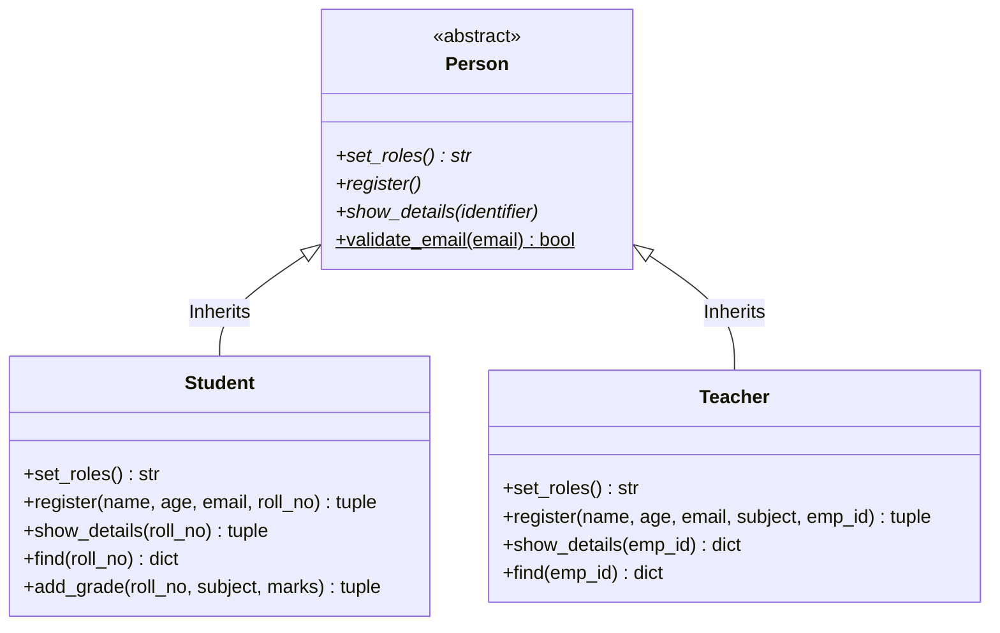

# 🎓 School Management System (OOP & Streamlit)

[](https://www.python.org/)
[](https://streamlit.io/)
[](#-oop-architecture--design-patterns)
[](#-database-schema)
[](LICENSE)

A modern, full-featured **School Management System** built in Python applying core **Object-Oriented Programming (OOP)** principles. It offers both an interactive **Streamlit Web Application** with real-time dashboards and a lightweight **Command-Line Interface (CLI)**, backed by a persistent JSON data store.

---

## 📑 Table of Contents

- [✨ Key Features](#-key-features)
- [🏛️ OOP Architecture & Design Patterns](#️-oop-architecture--design-patterns)
- [🖥️ User Interface Overview](#️-user-interface-overview)
- [📂 Project Structure](#-project-structure)
- [🚀 Getting Started](#-getting-started)
  - [Prerequisites](#prerequisites)
  - [Installation](#installation)
- [💡 How to Run](#-how-to-run)
  - [Option 1: Streamlit Web UI (Recommended)](#option-1-streamlit-web-ui-recommended)
  - [Option 2: Terminal / CLI Mode](#option-2-terminal--cli-mode)
- [🗄️ Database Schema](#️-database-schema)
- [🔮 Future Roadmap](#-future-roadmap)
- [👤 Author](#-author)

---

## ✨ Key Features

### 🖥️ Modern Streamlit Web UI
- **Live Analytics Dashboard**: Real-time counter metrics for total students and teachers, with responsive data tables showing roll numbers, email, subject count, and current grade averages.
- **Student Onboarding**: Simple registration form with duplicate roll number checks and built-in email syntax validation.
- **Teacher Onboarding**: Faculty registration with unique employee ID enforcement and subject assignment.
- **Grade Management**: Easily assign or update marks (0–100) per subject for any enrolled student.
- **Dynamic Search & Profiles**: Search student or teacher profiles by Roll Number or Employee ID with automatic average calculation and itemized scoreboards.

### 💻 Terminal / CLI Mode
- Fast, menu-driven CLI interface via `main.py`.
- No external browser or server required for quick headless operations.

### 💾 Persistent File Storage
- Auto-saves all student and teacher records directly into `school_data.json`.
- Automatic loading on startup ensures zero data loss between sessions.

---

## 🏛️ OOP Architecture & Design Patterns

The system is designed following the 4 core pillars of Object-Oriented Programming:



| OOP Pillar | Implementation in this Project |
| :--- | :--- |
| **Abstraction** | `Person` class inherits from `abc.ABC` and defines `@abstractmethod` blueprints (`set_roles`, `register`, `show_details`) that enforce a contract across all user models. |
| **Inheritance** | `Student` and `Teacher` inherit common attributes, contracts, and static utilities directly from the base `Person` class. |
| **Polymorphism** | Both `Student` and `Teacher` override and implement role-specific behaviors for `register()`, `show_details()`, and `set_roles()`. |
| **Encapsulation & Static Methods** | Input verification rules (e.g., `Person.validate_email()`) are encapsulated as reusable static methods, keeping validation logic isolated from UI handling. |

---

## 🖥️ User Interface Overview

The Streamlit UI provides a multi-page sidebar navigation experience:

```
🎓 School Management System
├── 📊 Dashboard              (Overview metrics & searchable master tables)
├── 📝 Register Student       (Student admission form with validation)
├── 👨‍🏫 Register Teacher       (Faculty registration & subject assignment)
├── 📈 Add Grade              (Marks entry system for exams/subjects)
├── 🔍 View Student Details   (Student scorecard & GPA average calculation)
└── 🔎 View Teacher Details   (Faculty profile viewer)
```

---

## 📂 Project Structure

```bash
project-oops-school-management-system-PYTHON/
│
├── app_UI.py           # Streamlit web application & UI presentation layer
├── main.py             # CLI application entrypoint (menu-driven)
├── school_data.json    # JSON persistent database store
├── pyproject.toml      # Project configuration & package metadata
└── README.md           # Project documentation
```

---

## 🚀 Getting Started

### Prerequisites
- **Python 3.10+** installed on your system.
- Recommended: [uv](https://github.com/astral-sh/uv) or standard `pip` with `venv`.

### Installation

1. **Clone the repository:**
   ```bash
   git clone https://github.com/mohd-ahtasham-ansari/project-oops-school-management-system-PYTHON.git
   cd project-oops-school-management-system-PYTHON
   ```

2. **Create and activate a virtual environment:**
   - **Using standard Python (`venv`):**
     ```bash
     # Windows (PowerShell)
     python -m venv .venv
     .venv\Scripts\activate

     # macOS / Linux
     python3 -m venv .venv
     source .venv/bin/activate
     ```
   - **Using `uv` (faster):**
     ```bash
     uv venv
     .venv\Scripts\activate  # Windows
     # source .venv/bin/activate  # macOS / Linux
     ```

3. **Install dependencies:**
   ```bash
   pip install streamlit
   # or with uv:
   uv pip install streamlit
   ```

---

## 💡 How to Run

### Option 1: Streamlit Web UI (Recommended)

To launch the modern dark-themed web portal:

```bash
streamlit run app_UI.py
```

After executing, the dashboard will open automatically in your default browser at:
`http://localhost:8501`

### Option 2: Terminal / CLI Mode

To run the interactive command-line application:

```bash
python main.py
```

You will be greeted with an interactive numeric menu:
```text
press 1 to register student
press 2 to register teacher
press 3 to add grades
press 4 to view student grades
press 5 to view teacher info
please tell your choice :-
```

---

## 🗄️ Database Schema

Data is stored as a human-readable JSON file in [school_data.json](school_data.json):

```json
{
    "students": [
        {
            "name": "Alex Smith",
            "age": 20,
            "email": "alex@example.com",
            "roll_no": "101",
            "grades": {
                "Mathematics": 95,
                "Physics": 88
            }
        }
    ],
    "teachers": [
        {
            "name": "Dr. Robert",
            "age": 42,
            "email": "robert@example.com",
            "subject": "Mathematics",
            "emp_id": "T-1001"
        }
    ]
}
```

---

## 🔮 Future Roadmap

- [ ] **Database Upgrade**: Migration support to SQLite / PostgreSQL via SQLAlchemy.
- [ ] **Role-Based Authentication**: Separate logins for Admins, Teachers, and Students.
- [ ] **Attendance Tracking**: Daily attendance register module.
- [ ] **Export Reports**: Download grade reports and transcripts as PDF / CSV.
- [ ] **Analytics Visualizations**: Altair/Plotly charts for grade distribution and class averages.

---

## 👤 Author

Developed by **[Mohd Ahtasham Ansari](https://github.com/mohd-ahtasham-ansari)**  
Feel free to star ⭐ the repository if you found this helpful!
